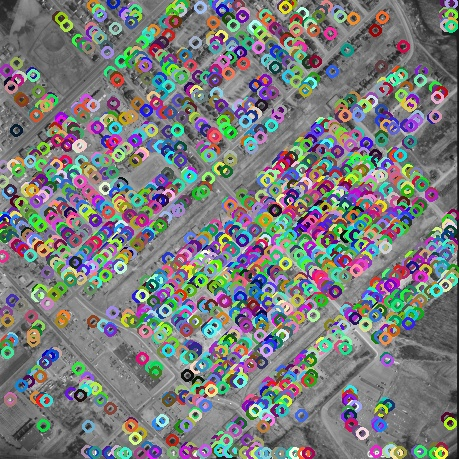
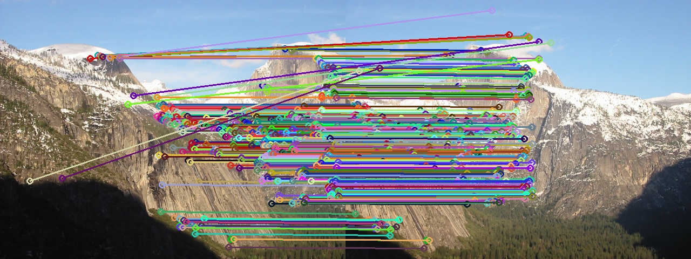

# 基于相关系数和最小二乘的影像匹配

此代码为数字摄影测量的课程代码，由于精力有限，实现了基于相关系数和最小二乘方法的影像匹配。

## 一、说明

程序源代码分为两部分，一部分是`detector`，一部分是`matcher`。

在`detector`部分，包含了角点检测相关的函数，主要有：Harris算子（OpenCV实现，进行了进一步封装），Moravec算子（自己实现）和SIFT（OpenCV实现，进行了进一步封装）

在`matcher`部分，包含了影像匹配的相关类，主要有：相关系数匹配（`CorrelationMatcher`）和最小二乘匹配（`LsqMatcher`）。

### 1.1 相关系数匹配

在相关系数匹配中，实现了两种匹配方式，分别对应`match`方法和`matchImproved`方法。

`match`方法为在参考影像中先提取特征点，然后遍历目标影像对每个特征点通过相关系数匹配，这种匹配方式得到的匹配点较多，但速度很慢。

`matchImproved`方法为在两幅影像中分别提取特征点，然后计算特征点之间的相关系数，这种方式虽然匹配的同名点有所较少，但是速度有显著提升。

### 1.2 最小二乘匹配

在最小二乘匹配中，需要为匹配提供初值，提供的方式可以先进行相关系数匹配，然后将相关系数匹配的结果用于最小二乘匹配。最小二乘匹配的结果为亚像素级别的角点，相对于相关系数匹配的整像素角点更精确。

在我的实际做法中，将相关系数匹配的阈值设置为0.85，然后将最小二乘匹配中的相关系数阈值设置为0.95。

## 二、使用

在使用代码前，需要自己在代码中更改两幅匹配影像路径、角点检测时的相关参数、匹配时窗口大小和阈值等。

代码依赖OpenCV和Eigen，编写时使用的OpenCV版本为3.4.14。

代码在Ubuntu 20.04下进行编写和测试，使用方法：

```bash
cd ImageMatch               // 切换到代码路径下
mkdir build && cd build
cmake ..    
make                        // 编译代码
./ImageMatch                // 运行程序
```

## 三、效果展示

### 3.1 影像LOR50和LOR49

#### （1）使用Moravec算子提取角点，阈值为700




#### （2）相关系数匹配结果


### 3.2 其他影像

#### （1）使用Moravec算子提取角点，阈值为700


#### （2）相关系数匹配结果


